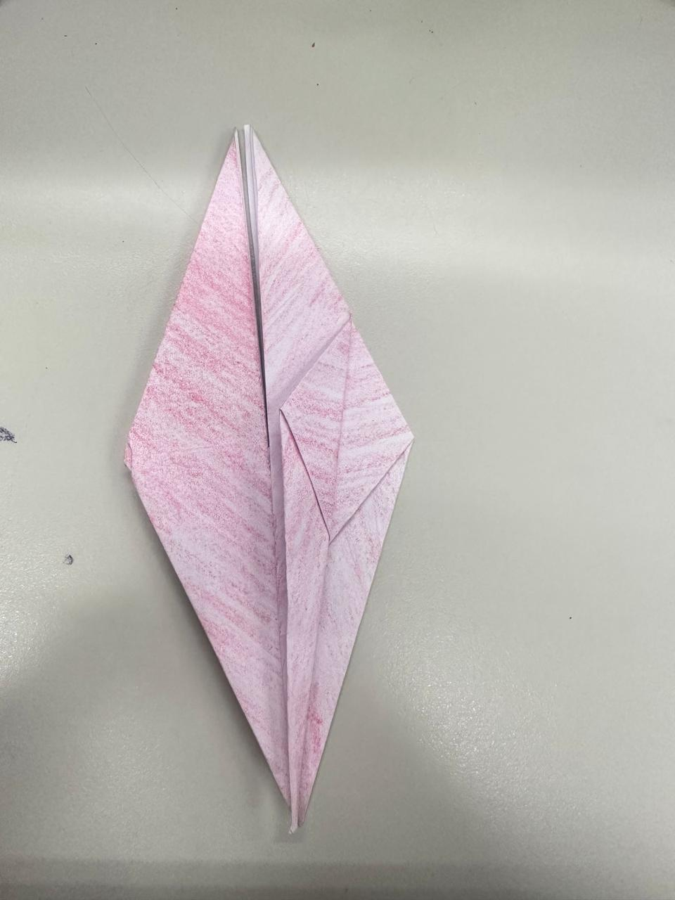

# Passo a passo de como fazer um Tsuru (Origami de Grou)

## Materiais Necessários: 
#### - 1 folha de papel sulfite cortada em formato quadrado (15 cm x 15 cm)

---

## 1º Passo — Dobras Iniciais

- Coloque o lado colorido (ou o lado que deseja que fique visível) voltado para cima.

- Dobre o papel ao meio na diagonal (formando um triângulo). Desdobre.  
- Repita a dobra na outra diagonal, formando um “X” de vincos no papel.

---

## 2º Passo — Criando uma Cruz

- Dobre o papel ao meio na horizontal e depois na vertical. Desdobre.

---

## 3º Passo — Formando a Base Quadrada

- Com todas as dobras feitas, segure os quatro cantos do papel e empurre-os em direção ao centro.  
- O papel se fechará naturalmente em um formato de quadrado. Essa é a base do Tsuru.  

---

## 4º Passo — Dobras Diagonais

- Pegue a aba inferior e dobre sua borda diagonal em direção ao centro. Desdobre.  
- Repita o mesmo com a aba lateral esquerda. Desdobre.  
- Essas dobras vão servir como guias para os próximos passos.  

---

## 5º Passo — Criando Novos Pontos

- Levante a camada inferior e dobre criando um vinco horizontal que conecta os pontos marcados nas dobras anteriores.  

---

## 6º Passo — Finalizando a Forma Base

- Dobre as abas laterais (direita e esquerda) em direção ao centro, formando uma nova ponta na parte superior.  
- Vire o papel e repita o processo do outro lado.  

---

## 7º Passo — Reforçando as Dobras

- Dobre levemente a nova ponta para baixo, apenas para marcar o vinco.  
- Vire o papel e repita do outro lado.  

---

## 8º Passo — Moldando o Tsuru

- Abra uma das pontas mais finas e dobre-a para cima: esta será a **cabeça do Tsuru**.  
- Dobre a ponta oposta também para cima: esta será a **cauda**.  

---

## 9º Passo — Criando as Asas

- Dobre as pontas maiores (laterais) para baixo, formando as asas do Tsuru.  

---

## 10º Passo — Toques Finais

- Ajuste a cabeça e abra levemente as asas, deixando o Tsuru com uma aparência equilibrada e elegante.  

---

## 🎉 Parabéns!

Seu Tsuru está completo

